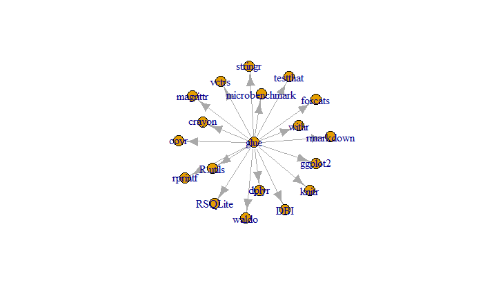

```{r knitrOptions, include=FALSE}
knitr::opts_chunk$set(
  collapse = TRUE,
  comment = "#>"
)
```

```{r localCache, echo=FALSE}
withr::local_envvar(
  R_USER_CACHE_DIR = tempfile(),
  R_COMPILE_AND_INSTALL_PACKAGES = "always"
)
```

```{r setup}
library(PaRe)
```

For the examples in this vignette `glue` will be used as an example. `glue` version *1.6.2.9000* is included in the system files of `PaRe` and is thus accessible even if these examples are ran offline.

`PaRe` does fetch some online resources through the package `pak`. And by default online stored csv-files in the `PaRe::whiteList` data.frame. If no connection can be made, functions using these methods to reference these online resources will return `NULL`.

## Whitelist Data Frame
`PaRe` includes a data frame which contains links to csv-files to be used in the `PaRe::checkDependencies` and `PaRe::getDefaultPermittedPackages` functions.

By default the data frame contains the following information.
```{r whiteList}
PaRe::whiteList
```

The data frame contains 4 columns:

1. *source*: Source name.
2. *link*: Link or path to the csv-file.
3. *package*: Column name in the referenced csv-file that contains the package names.
4. *version*: Column name in the referenced csv-file that contains the package versions.

If you wish to alter the sources in just your R-session, you can either add, remove, or replace individual rows in the whiteList data frame.
```{r whiteListSession}
sessionWhiteList <- rbind(
  whiteList,
  list(
    source = "dummySession",
    link = "some/file.csv",
    package = "package",
    version = "version"
  )
)

sessionWhiteList
```

If you wish to make more permanent alterations to the `whiteList` data frame, you can edit the whiteList.csv file in the PaRe system files.
```{r setupWhiteList}
fileWhiteList <- rbind(
  read.csv(
    system.file(
      package = "PaRe",
      "whiteList.csv"
    )
  ),
  list(
    source = "dummyFile",
    link = "some/file.csv",
    package = "package",
    version = "version"
  )
)

fileWhiteList
```

```{r writeWhiteList, eval=FALSE}
write.csv(
  fileWhiteList,
  system.file(
    package = "PaRe",
    "whiteList.csv"
  )
)
```

## Dependency Review
Before we start diving into the dependency usage of `glue` we should first establish what our dependency white list even looks like. We can retrieve our full list of whitelisted dependencies buy calling the `getDefaultPermittedPackages` function.

### getDefaultPermittedPackages
```{r permittedPackages, eval=FALSE, message=FALSE, warning=FALSE}
PaRe::getDefaultPermittedPackages(base = TRUE)
```

`getDefaultPermittedPackages` takes one parameter:

1. **base** which is set to `TRUE` by default. Packages that listed as *base* packages will be included in the white list.

### Setting up a Repository object
```{r cloneRepoShow, eval=FALSE}
# Temp dir to clone repo to
tempDir <- tempdir()
pathToRepo <- file.path(tempDir, "glue")

# Clone IncidencePrevalence to temp dir
git2r::clone(
  url = "https://github.com/tidyverse/glue.git",
  local_path = pathToRepo
)

repo <- PaRe::Repository$new(path = pathToRepo)
```

```{r cloneRepo, echo=FALSE}
fetchedRepo <- tryCatch(
  {
    tempDir <- tempdir()
    pathToRepo <- file.path(tempDir, "glue")

    git2r::clone(
      url = "https://github.com/tidyverse/glue.git",
      local_path = pathToRepo
    )

    repo <- PaRe::Repository$new(path = pathToRepo)
    TRUE
  },
  error = function(e) {
    FALSE
  },
  warning = function(w) {
    FALSE
  }
)
```

### checkDependencies
Now that we know what is included in the white list, we can make our first step into reviewing `glue`, which is to ensure the (suggested) dependencies `glue` uses are in our white list.
```{r checkDependenciesShow, eval=FALSE}
PaRe::checkDependencies(repo = repo)
```
```
→ The following are not permitted: covr, microbenchmark, R.utils, rprintf, testthat                  
→ Please open an issue here: https://github.com/mvankessel-EMC/DependencyReviewerWhitelists/issues
```
|        package | version |
| -------------- | ------- |
|           covr |       * |		
| microbenchmark |       * |
| 	      R.utils|       * |
|         rprintf|       * |
|       testthat |   3.0.0 |

Not all suggested dependencies are approved. The function prints a message and returns a data frame, containing all packages that are not listed in our white list.

`checkDependecies` takes two parameters:

1. **pkgPath** which specifies the path to the pacakge.
2. **dependencyType** a vector of character items which specify kinds of imports to look at.

### getGraphData
glue depends on (suggested) dependencies. These dependencies in turn import other dependencies, and so on. We can investigate how these recursive dependencies depend on one another, by investigating it as a graph.
```{r setupGraphShow, eval=FALSE}
graphData <- PaRe::getGraphData(
  repo = repo,
  packageTypes = c("imports", "suggests")
)
```

We can compute several statistics about our dependency graph
```{r graphCharacteristicsShow, eval=FALSE}
data.frame(
  countVertices = length(igraph::V(graphData)),
  countEdges = length(igraph::E(graphData)),
  meanDegree = round(mean(igraph::degree(graphData)), 2),
  meanDistance = round(mean(igraph::distances(graphData)), 2)
)
```
- **countVertices** resembles the amount of recursive dependencies `glue` depends on.
- **countEdges**: are the total amount of imports of all dependencies.
- **meanDegree**: is the average amount of imports per dependency.
- **meanDistance**: is the average amount of dependencies between `glue` and all other recursive dependencies.

We can then plot the graph.
```{r plotGraphShow, eval=FALSE}
plot(graphData)
```


## Package wide function use
`PaRe` allows you to get insight in the function usage in a package.

### summariseFunctionUse
```{r summariseFunctionUseShow, eval=FALSE}
funsUsed <- PaRe::getFunctionUse(repo = repo)
funsUsed
```

```{r summariseFunctionUse, echo=FALSE, message=FALSE, warning=FALSE}
if (fetchedRepo) {
  funsUsed <- PaRe::getFunctionUse(repo = repo)
  funsUsed
}
```

### getDefinedFunctions
```{r definedFunctionsShow, eval=FALSE}
defFuns <- PaRe::getDefinedFunctions(repo = repo)
head(defFuns)
```

```{r definedFunctions, echo=FALSE}
if (fetchedRepo) {
  defFuns <- PaRe::getDefinedFunctions(repo = repo)
  head(defFuns)
}
```
Besides the location of each function being displayed, the number of arguments for each function, and the cyclometic complexity is also included in the result.

```{r pkgDiagramShow, eval=FALSE}
PaRe::pkgDiagram(repo = repo) %>%
  DiagrammeRsvg::export_svg() %>%
  magick::image_read_svg()
```

```{r pkgDiagram, echo=FALSE}
if (fetchedRepo) {
  if (all(c(
    require("DiagrammeRsvg", character.only = TRUE),
    require("magick", character.only = TRUE)))) {
      PaRe::pkgDiagram(repo = repo) %>%
        DiagrammeRsvg::export_svg() %>%
        magick::image_read_svg()
  }
}
```

## Lines of code
```{r linesOfCodeShow, eval=FALSE}
PaRe::countPackageLines(repo = repo)
```

```{r linesOfCode, echo=FALSE}
if (fetchedRepo) {
  PaRe::countPackageLines(repo = repo)
}
```
`glue` contains 1056 lines of R-code.

## Linting
```{r lintScoreShow, eval=FALSE}
messages <- PaRe::lintRepo(repo = repo)
PaRe::lintScore(repo = repo, messages = messages)
```

```{r lintScore, echo=FALSE}
if (fetchedRepo) {
  messages <- PaRe::lintRepo(repo = repo)
  PaRe::lintScore(repo = repo, messages = messages)
}
```

```{r lintMessagesShow, eval=FALSE}
head(messages)
```

```{r lintMessages, echo=FALSE}
if (fetchedRepo) {
  head(messages)
}
```

